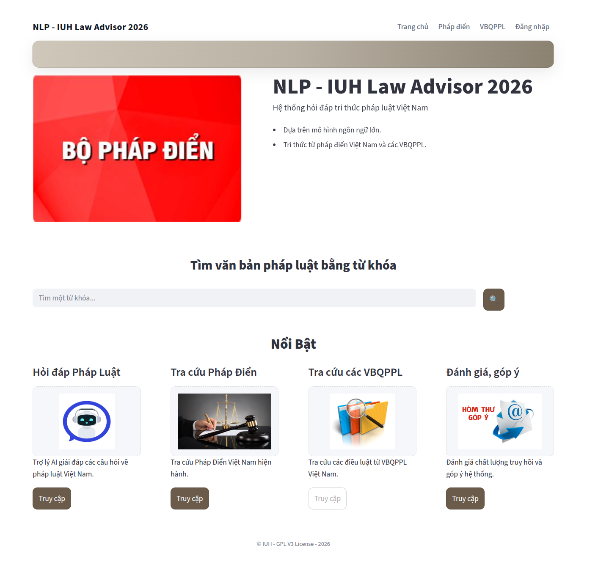
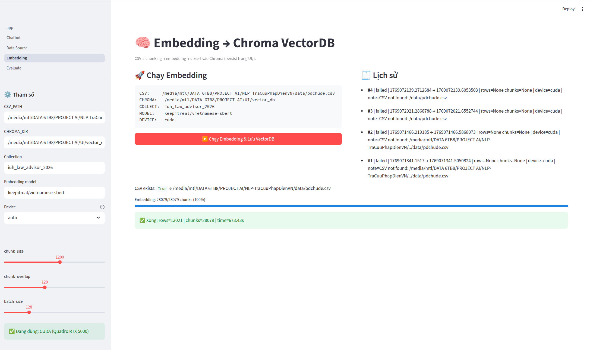

# Thành viên thực hiện
```bash
Bùi Quang Thái
Huỳnh Thanh Vinh
Phan Văn Trung
```
# Giao diện ứng dụng


# Giao diue65n Embedding


Vào thư mục dự án thấy có tập tin ".env.example" Hãy copy ra và đặt tên là ".env" tập tin này sẽ khởi tạo biiến môi trường cho toàn bộ dự án.

# Lệnh chạy app: Trong thư mục UI/: sử dụng Python 3.12
```bash
cd UI
pip install -r requirements.txt
streamlit run app.py
```
# Nếu thiếu môi trường, cài thêm thư viện
```bash
pip install -U streamlit pandas numpy tqdm chromadb sentence-transformers torch huggingface_hub python-dotenv
```
# Các  câu hỏi demo truy vấn hệ thống RAG
```bash
Doanh nghiệp có được ưu tiên nào khi làm thủ tục hải quan
Đăng ký khai sinh được thực hiện như thế nào ?
Mức thu nộp tiền khi sử dụng đường bộ.
```

